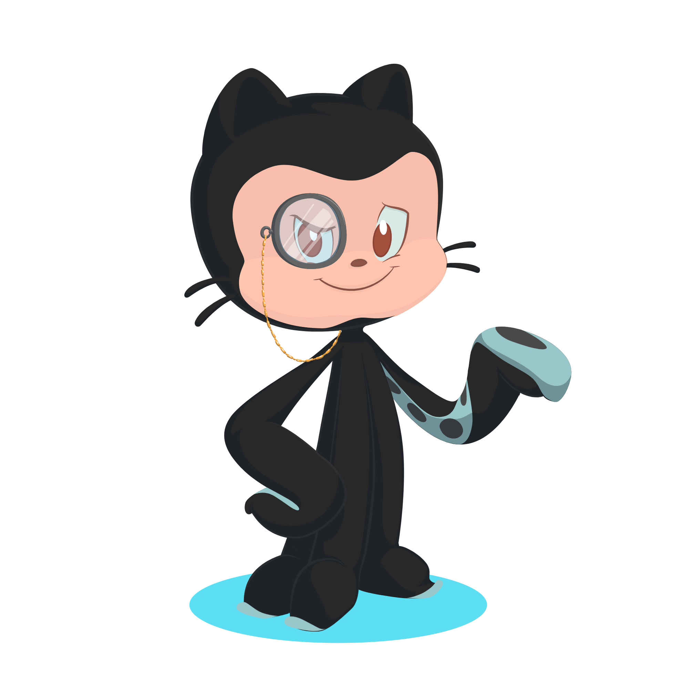

## Oiii! Sou a Ester Lino! Seja bem-vind@! 👋

**Engenheira de Software** formada pela UnB/FCTE
- 💻 Desenvolvedora **Java** e coordenação de operações em time que atende o setor público
- 🌱 Me interesso por **Gestão de Projetos**, **Machine/Deep Learning** e **Ciência de Dados**
- 🧪 Do embarcado ao distribuído: sistemas paralelos, deep learning e IoT

### 🚀 Projetos em destaque

| Projeto | O que é | Stack |
|---|---|---|
| **[Pipeline DICOM Distribuído + Observabilidade](https://github.com/esteerlino/PSPD)** | Processamento distribuído de imagens médicas e monitoramento em Kubernetes | `K8s` `Docker` |
| **[Feed Buddy](https://github.com/esteerlino/trabalho-final-feedbuddy)** | Alimentador automático de pets — sistemas embarcados de ponta a ponta | `C` |
| **[Alectrion](https://github.com/esteerlino/2023-1-Alectrion-DOC)** | Sistema de gestão de inventário e ordens de serviço para a Polícia Civil de Goiás — projeto EPS/MDS com cliente real | `Gestão` `TypeScript` |
| **[Gov.br — Engenharia de Requisitos](https://github.com/esteerlino/2024.1-Gov.br)** | Elicitação e análise de requisitos do aplicativo gov.br, aplicando boas práticas de engenharia de requisitos | `Requisitos` `Análise` |
| **[Querido Diário](https://github.com/esteerlino/T2G4-Querido-Diario)** | Contribuição ao projeto open source de diários oficiais brasileiros, via Residência TIC | `Open Source` `Docs` |
| **[OnlineJudge — IHC](https://github.com/esteerlino/2023.2-OnlineJudge)** | Avaliação de usabilidade e propostas de redesenho de interface para plataforma de juiz online | `UX/IHC` `Design` |

### Contato

### Linguagens e ferramentas

                   

### Github Analytics

  
  

